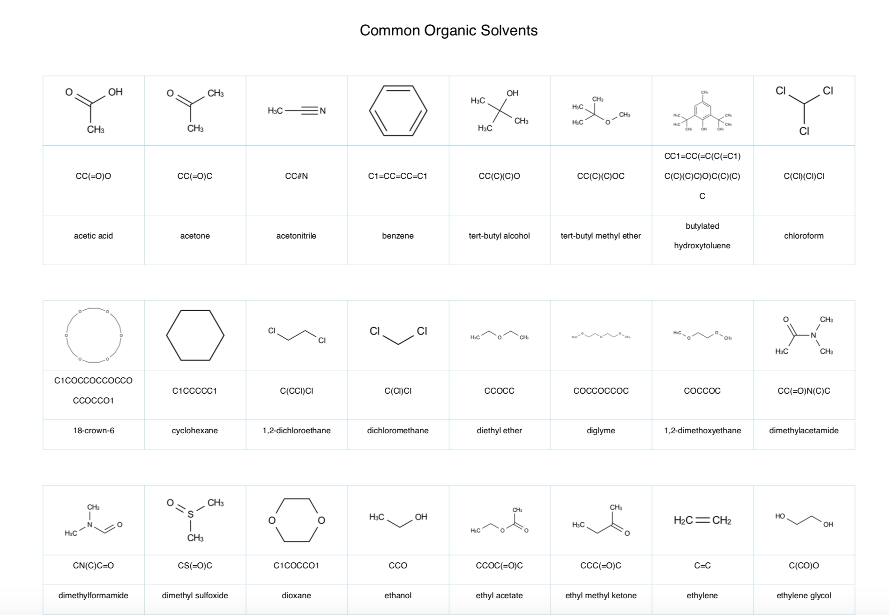

MolPDF: A PDF Document Generator for SMILES!
============================================

[](https://opensource.org/licenses/MPL-2.0)

[](https://badge.fury.io/py/molpdf)
[](http://makeapullrequest.com)
[](https://zenodo.org/badge/latestdoi/256060429)


Welcome to MolPDF! The document generator for cheminformatics! MolPDF does one thing right now and is convert a list of 1D 
SMILES to a 2D image into a PDF! It's super lightweight and only requires python 3.4 >+. 

MolPDF is super new and under heavy development so if there are any bugs then please report them! Eventually, I will be able 
to get some docs, jupyter notebooks, and some asciis but in the meantime check out the source code and play around. 

Announcements
=============

-   June 7th 2020 First version 0.1.0 is released to the public
-   June 19th 2020 Second version 0.2.0 is released to the public with MolPDFParser
-   September 30th 2021 Fourth version with patches 0.4.2 is released to the public with redesign of MolPDF

Installation 
============

MolPDF is going to be distribute via PyPi and as the content store grows we can expand it to other pieces of software
making it accessible to all regardless of what you use. Alternatively, you could have a glance at the source code and copy/paste
it yourself.

```

    pip install molpdf

```

QuickStart
==========

Generate a PDF of SMILES

```
    from molpdf import MolPDF
    
    common_organic_solvents_smiles = {
            'acetic acid': 'CC(=O)O',
            'acetone' : 'CC(=O)C',
            'acetonitrile': 'CC#N',
            'benzene': 'C1=CC=CC=C1',
            'tert-butyl alcohol': 'CC(C)(C)O',
        
    }
    
    smiles_list = list(list(common_organic_solvents_smiles.values()))
    labels = list(list(common_organic_solvents_smiles.keys()))
    document = MolPDF(name='common_organic_solvents.pdf')
    document.add_title('Common Organic Solvents')
    document.add_spacer()
    document.generate(smiles=smiles_list, labels=labels, include_failed_smiles=True)

```

<p align="center">
  
</p>

Read a MolPDF Generated File into SMILES

```

    document = MolPDFParser('example.pdf')
    smiles_list = document.extract_smiles()
    print (smiles_list)
    >>> ['C(CNC(C(C)N)=O)(=O)O', 'C(CNC(C(C)N)=O)(=O)O', 'C(CNC(C(C)N)=O)(=O)O']

```


Generate a List a PDF of Amino Acids

```

    # Turning an Amino Acid List into a PDF
    

    amino_acid_side_chains = {
        "alanine": "C",  "arginine": "CCCCNC(N)=N", "asparagine": "CCC(N)=O", "aspartic acid": "CC(O)=O",
        "cysteine": "CS", "glutamic acid": "CCC(O)=O", "glutamine": "CCC(N)=O", "glycine": "[H]",
        "histidine": "CC1=CNC=N1", "isoleucine": "C(CC)([H])C", "leucine": "CC(C)C", "lysine": "CCCCN",
        "methionine": "CCSC", "phenylalanine": "CC1=CC=CC=C1", "proline": "C2CCCN2", "serine": "CO",
        "threonine": "C(C)([H])O", "tryptophan": "CCC1=CNC2=C1C=CC=C2", "tyrosine": "CC1=CC=C(O)C=C1",
        "valine": "C(C)C"
    }

    document = MolPDF(name='amino_acids.pdf')
    document.add_title('Chemical Library Test')
    document.add_spacer()

    smiles_amino_acids = list(amino_acid_side_chains.values())
    document.generate(smiles=smiles_amino_acids, include_failed_smiles=True)
    
```

Performance
===========

Generating the 2D images into a PDF can be cumbersome if you have a large chemical library - below 
I have some average time statistics of how fast a PDF can be generated and parsed using MolPDF and MolPDFParser.


Method: 'MolPDF.generate()'

Length of Smiles: 10 | Time to execute: ~ 0.19 seconds
Length of Smiles: 100 | Time to execute: ~ 1.29 seconds
Length of Smiles: 1000 | Time to execute: ~ 12.17 seconds
Length of Smiles: 10000 | Time to execute: ~ 178.88 seconds


Structure of MolPDF
=======================

Currently, the main subpackages are:

- **molpdf**: molpdf main class. 


Genesis
=======

MolPDF was developed so I could publish chemical libraries in an easy supporting information minable data for publications. 
I hope to make it easy for folk by making it a solely lightweight python package with only requirements to be reportlab. 

- Lead Developer [Suliman sharif](http://sulstice.github.io/)

* * * * *

External links
==============


